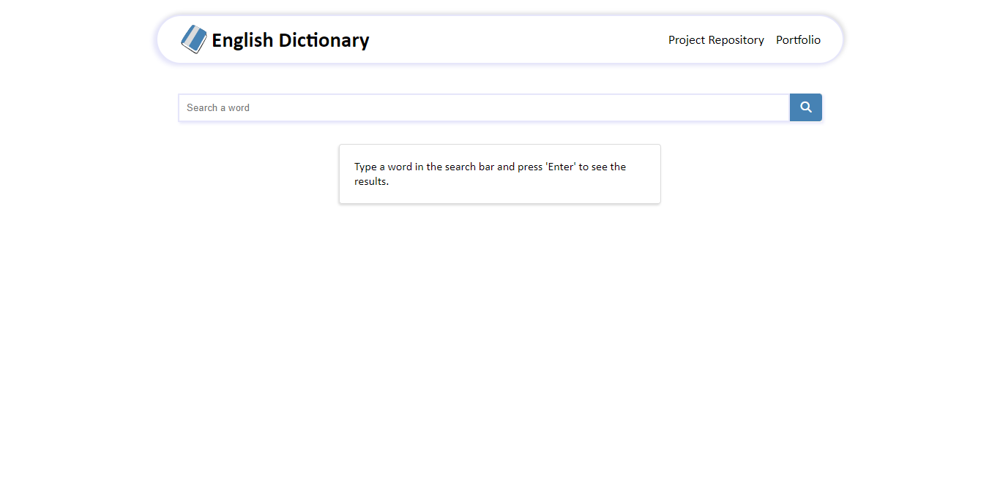
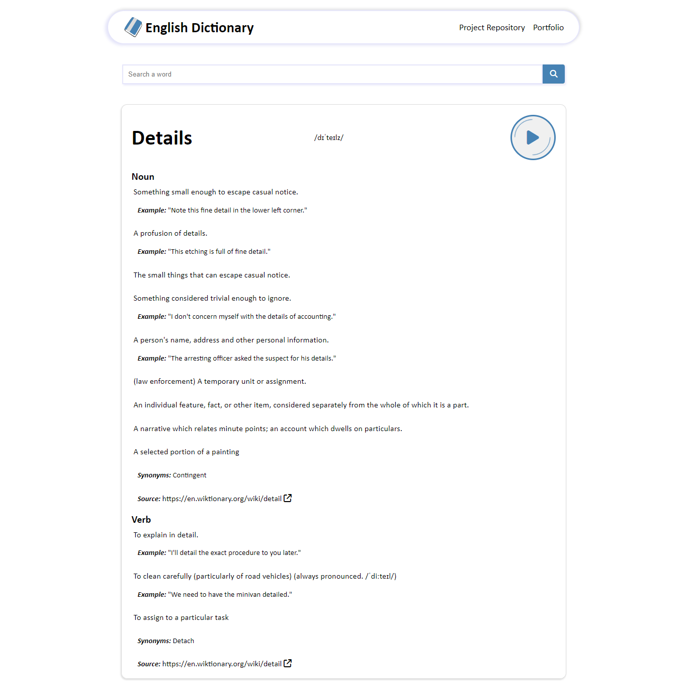

# English Dictionary

In this project, I prepared an English-to-English dictionary. Thanks to this dictionary, you can both see and listen to the pronunciation of words. Moreover, you can also examine the sentence examples, synonyms and antonyms of the relevant word, if available.

## Technologies & Libraries

> Vue 3

> Vite

> [Free Dictioary Api](https://dictionaryapi.dev/)

### Screenshots

